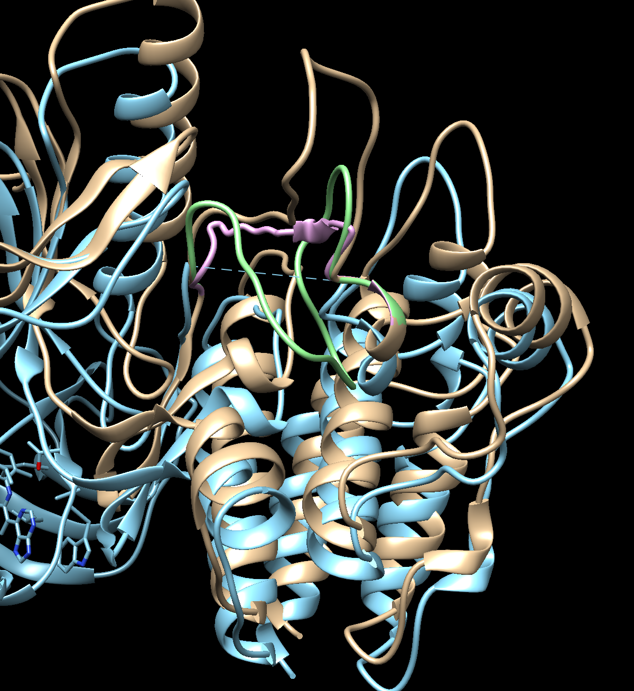
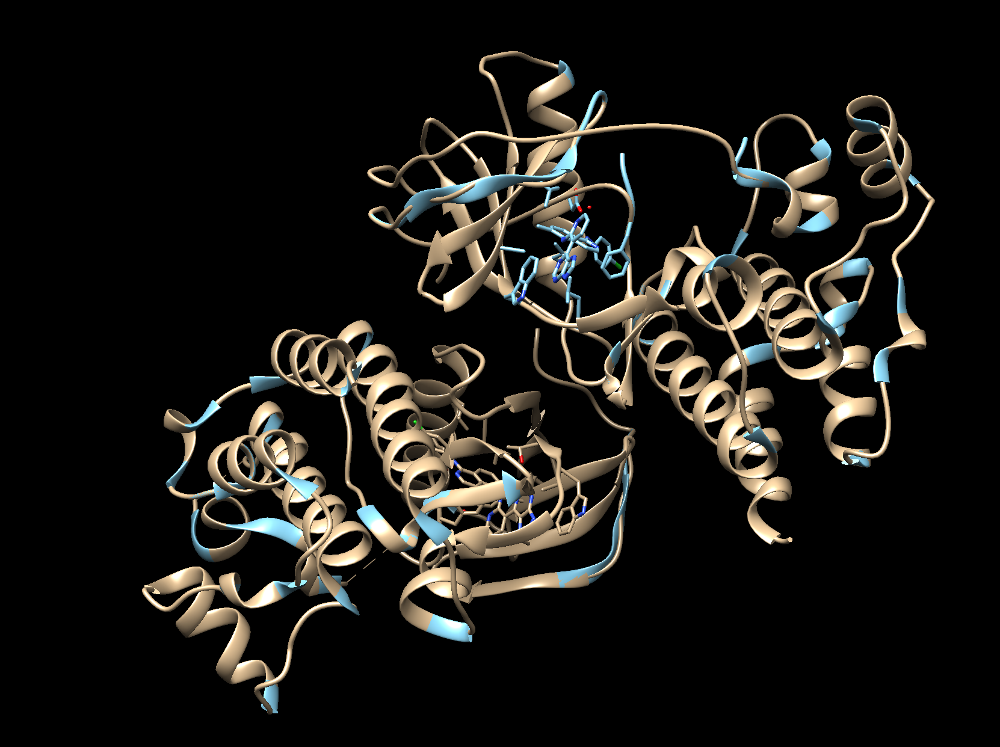
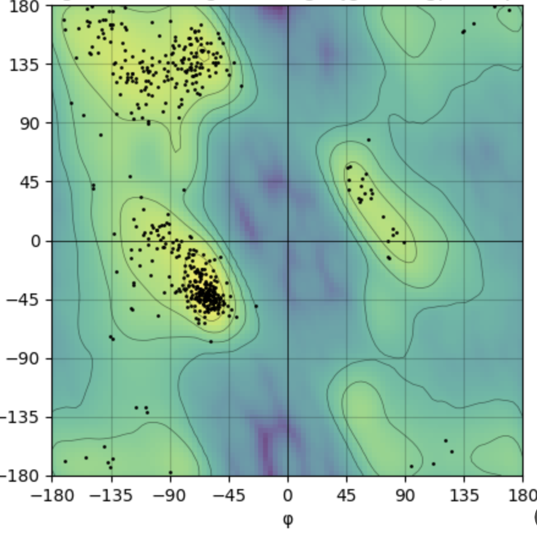

# LoopsAndRibbons API 🧬

A RESTful API service for predicting missing loops in protein structures using both simple interpolation and Modeller-based approaches.

## Overview 🔬

This project provides tools for identifying and predicting missing regions (loops) in protein structures. It offers two prediction methods:
1. **Simple Predictor**: Uses linear interpolation with random variation for quick predictions
2. **Modeller Predictor**: Uses Modeller for more accurate, physics-based predictions

---

## Current Implementation ✅

- **Core Utilities and Classes** (in `loops_api/utils/`):
  - `base_loop_predictor.py`: Base class for predictors, structure parsing, sequence mapping, and region detection
  - `simple_predictor.py`: Simple interpolation-based loop predictor
  - `modeller_predictor.py`: Modeller-based loop predictor
  - `prediction_result.py`: Result writing and summary utilities
  - `loop_assembler.py`: Assembles final structures, handles renumbering, and generates Ramachandran plots
- **Test Script**
  - `test_loop_predictor.py`: End-to-end tests for predictors and structure assembly
- **Results and Examples**
  - Example output images and PDBs in `predictions/`
  - Example Ramachandran plots and structure visualizations
---

## Not Yet Implemented / Future Work 🚧

- **API Endpoints**
  - The FastAPI endpoints described below are **not yet implemented**. They are planned for a future release.
  - No running REST API server is provided yet
- **Dockerization**
  - No Dockerfile or containerization is provided yet
- **AlphaFold & RareFold Integration**
  - No AlphaFold or RareFold support yet (see Future Work below)
- **Production Deployment**
  - No deployment scripts or cloud setup
- **Batch Processing & Monitoring**
  - No real-time progress or batch job support

---

## Installation 🛠️

```bash
# Install dependencies using uv
uv pip install -e .
```

### Requirements
- Python 3.8+
- FastAPI
- Biopython
- NumPy
- Modeller (optional, for Modeller-based predictions)

## Project Structure 📁

```
LoopsAndRibbons/
├── loops_api/
│   ├── utils/
│   │   ├── base_loop_predictor.py    # Base class with common functionality
│   │   ├── simple_predictor.py       # Simple interpolation implementation
│   │   └── modeller_predictor.py     # Modeller-based implementation
│   │   ├── prediction_result.py      # Result writing utilities
│   │   └── loop_assembler.py         # Structure assembly and analysis
│   ├── api/
│   │   ├── routes.py                 # (Placeholder) API endpoint definitions
│   │   └── models.py                 # (Placeholder) Pydantic models for request/response
│   └── test_loop_predictor.py        # Test suite
├── predictions/                      # Output directory for predictions
├── pyproject.toml                    # Project configuration
└── README.md
```

## Features ✨

### Base Loop Predictor
- Structure loading and parsing (PDB/mmCIF)
- Missing region detection
- Sequence mapping and validation
- Quality score calculation
- Results saving and formatting

### Simple Predictor
- Linear interpolation with random variation
- Fast predictions for quick results
- Basic quality metrics

### Modeller Predictor
- Physics-based loop modeling
- Multiple conformation generation
- Advanced quality assessment
- Complete structure generation

### Loop Assembler
- Robust structure merging and renumbering
- Ramachandran plot generation
- Output in PDB format


## Example Results

| Missing Region Models | Structure & Missing | Ramachandran Plot |
|----------------------|---------------------|-------------------|
|  |  |  |

---
## Example Prediction Summary

A `prediction_summary.json` file is generated in each prediction directory. Example:

```json
{
  "timestamp": "20250616_120450",
  "region_metadata": {
    "chain_id": "B",
    "start_res": 597,
    "end_res": 614,
    "length": 16,
    "missing_sequence": "ATEKSRWSGSHQFEQL",
    "full_chain_sequence": "HHHHHHDRNRMKTLGRRDSSDDWEIPDGQITVGQRIGSGSFGTVYKGKWHGDVAVKMLNVTAPTPQQLQAFKNEVGVLRKTRHVNILLFMGYSTKPQLAIVTQWCEGSSLYHHLHIIETKFEMIKLIDIARQTAQGMDYLHAKSIIHRDLKSNNIFLHEDLTVKIGDFGLATEKSRWSGSHQFEQLSGSILWMAPEVIRMQDKNPYSFQSDVYAFGIVLYELMTGQLPYSNINNRDQIIFMVGRGYLSPDLSKVRSNCPKAMKRLMAECLKKKRDERPLFPQILASIELLARSLPKIHRS"
  },
  "num_models": 1,
  "models": [
    {
      "model_number": 1,
      "quality_score": -31798.841796875,
      "ga341_score": [
        1.0,
        0.30858367681503296,
        -340.16363525390625,
        -13.651281356811523,
        -9.861736297607422,
        -8.024914741516113,
        -6.65782356262207,
        -11.363975524902344
      ],
      "model_file": "model.B99990001.pdb"
    }
  ]
}
```


## Quality Metrics 📊

The quality of predicted loops and models is assessed using:

**For Modeller-based predictions:**
- **DOPE Score**: Discrete Optimized Protein Energy, a statistical potential used by Modeller to evaluate model quality
- **GA341 Score**: (if available) A Modeller score for model reliability
- **Other Model-Specific Scores**: Any additional scores provided by the prediction method (e.g., energy, confidence)
- All scores are included in the `prediction_summary.json` for each prediction

**For Simple Predictor:**
- **Distance from start/end points**
- **Loop smoothness** (angle between segments)
- **Bond length consistency**

For simple predictors, geometric criteria are primary. For Modeller-based predictions, the above model-specific scores are primary.

## Limitations ⚠️

### General Limitations
- No support for multi-chain loop predictions
- No support for non-protein molecules (DNA, RNA, ligands)

### Simple Predictor Limitations
- No consideration of protein physics or energy minimization
- May produce unrealistic conformations for long loops
- Quality scores are based on geometric criteria only
- Not suitable for loops with complex secondary structure

### Modeller Predictor Limitations
- Requires valid Modeller license
- Significantly slower than Simple Predictor
- Memory intensive for large structures
- May fail for very long loops (>20 residues)
- Limited to standard amino acids

## Future Work 🔮

### AlphaFold Integration *(Planned)*
- Integration with AlphaFold2 for high-accuracy loop predictions
- Support for multi-chain predictions
- Improved handling of long loops (>30 residues)
- Better prediction of loops with complex secondary structure
- Integration with AlphaFold's confidence metrics

### RareFold Integration *(Planned)*
- Implementation of [RareFold](https://github.com/patrickbryant1/RareFold)'s specialized loop prediction
- Support for rare loop conformations
- Improved accuracy for challenging loop regions
- Integration with RareFold's quality assessment
- Enhanced handling of non-canonical loop structures

## License

MIT
